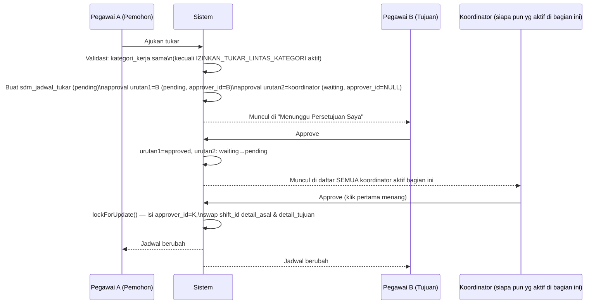
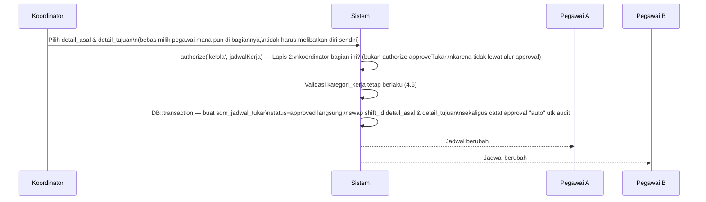

# Panduan Pengembangan Modul Jadwal Kerja Pegawai — RSBA Office

Modul **Jadwal Kerja Pegawai** adalah sumber kebenaran tunggal untuk "pegawai ini seharusnya kerja tanggal & jam berapa" — dasar untuk modul Absensi (fase terpisah, belum dikerjakan). Domain: **SDM** (`App\Models\Sdm\...`, prefix tabel `sdm_jadwal_*`), sejajar dengan `Karyawan`, `Bagian`, `Jabatan` yang sudah ada. Bukan `jadwal_*` generik — nama itu sudah dipakai domain Maintenance (`maintenance_jadwals`).

Dokumen ini disusun **berurutan sesuai urutan pembangunan** — tiap bagian adalah prasyarat bagian setelahnya. Kerjakan dari atas ke bawah.

---

## 1. Konsep & Terminologi

| Istilah | Arti |
|---|---|
| **Shift** | Definisi jam kerja presisi (Pagi/Siang/Malam/Reguler). Master global. |
| **Kategori Kerja** | Atribut pegawai: `shift` (bergilir) atau `reguler` (jam kantor tetap). Melekat ke orang, bukan ke bagian — satu bagian bisa campuran. |
| **Koordinator** | Pegawai berwenang menyusun & publish jadwal, serta approve tukar jadwal, **untuk bagian tertentu**. Relasi **many-to-many**: satu bagian bisa >1 koordinator, satu orang bisa jadi koordinator di >1 bagian. |
| **Aturan Jadwal** | Batasan bisnis per bagian (maks shift malam berturut-turut, dst.), disimpan sebagai data supaya tidak hardcode dan bisa beda tiap bagian. |
| **Jadwal Kerja** (header) | Satu set rencana kerja untuk satu bagian, satu bulan. Status `draft` → `published` → `locked`. |
| **Detail Jadwal** | Rencana kerja 1 pegawai pada 1 tanggal — unit terkecil, satu baris ada untuk **setiap** tanggal termasuk hari libur (`shift_id = null`), supaya nanti modul absensi bisa bedakan "libur terjadwal" vs "tidak hadir". |
| **Tukar Jadwal** | Pertukaran shift antar 2 pegawai. Kalau diajukan **pegawai biasa**: disetujui berjenjang (pegawai tujuan → koordinator bagian). Kalau diajukan **koordinator sendiri**: langsung tereksekusi tanpa persetujuan siapa pun — alasannya operasional (kondisi RS lagi ramai, dll.), koordinator memang pemegang otoritas tertinggi untuk jadwal di bagiannya, jadi tidak masuk akal koordinator minta persetujuan ke dirinya sendiri. |

---

## 2. Fase 0 — Master & Konfigurasi Dasar

Semua di fase ini adalah **prasyarat**: tanpa ini, generate jadwal tidak tahu shift apa yang valid, siapa koordinatornya, atau aturan apa yang berlaku.

### 2.1 Migration

Urutan pembuatan migration (mengikuti dependensi FK):

**a. Kolom `kategori_kerja` di `sdm_karyawan`**

```php
Schema::table('sdm_karyawan', function (Blueprint $table) {
    $table->enum('kategori_kerja', ['shift', 'reguler'])->default('reguler')->after('status');
});
```

**b. `sdm_jadwal_shift` (master shift)**

```php
Schema::create('sdm_jadwal_shift', function (Blueprint $table) {
    $table->id();
    $table->string('kode', 10)->unique();        // 'PAGI', 'SIANG', 'MALAM', 'REGULER'
    $table->string('nama', 30);
    $table->time('jam_masuk');
    $table->time('jam_keluar');
    $table->unsignedSmallInteger('toleransi_telat_menit')->default(15); // dipakai fase absensi nanti
    $table->string('warna', 10)->nullable();      // hex warna tampilan kalender
    $table->boolean('lintas_hari')->default(false); // true kalau jam_keluar < jam_masuk (shift malam)
    $table->boolean('aktif')->default(true);
    $table->unsignedBigInteger('created_by')->nullable();
    $table->unsignedBigInteger('updated_by')->nullable();
    $table->timestamps();
});
```

> Setiap bagian yang punya pegawai `kategori_kerja=reguler` wajib punya minimal satu shift berkode `REGULER` — dipakai auto-fill saat generate (lihat 3.2).

**c. `sdm_bagian_koordinator` (pivot, many-to-many)**

```php
Schema::create('sdm_bagian_koordinator', function (Blueprint $table) {
    $table->id();
    $table->unsignedBigInteger('bagian_id');
    $table->unsignedBigInteger('karyawan_id');
    $table->boolean('aktif')->default(true); // soft-disable tanpa hapus histori
    $table->unsignedBigInteger('created_by')->nullable();
    $table->unsignedBigInteger('updated_by')->nullable();
    $table->timestamps();

    $table->foreign('bagian_id')->references('id')->on('bagian')->onDelete('cascade');
    $table->foreign('karyawan_id')->references('id')->on('sdm_karyawan')->onDelete('cascade');
    $table->unique(['bagian_id', 'karyawan_id'], 'uniq_bagian_koordinator');
});
```

**d. `sdm_bagian_shift` (shift mana valid di bagian mana)**

```php
Schema::create('sdm_bagian_shift', function (Blueprint $table) {
    $table->id();
    $table->unsignedBigInteger('bagian_id');
    $table->unsignedBigInteger('shift_id');
    $table->timestamps();

    $table->foreign('bagian_id')->references('id')->on('bagian')->onDelete('cascade');
    $table->foreign('shift_id')->references('id')->on('sdm_jadwal_shift')->onDelete('cascade');
    $table->unique(['bagian_id', 'shift_id'], 'uniq_bagian_shift');
});
```

**e. `sdm_jadwal_aturan` (aturan bisnis per bagian)**

```php
Schema::create('sdm_jadwal_aturan', function (Blueprint $table) {
    $table->id();
    $table->unsignedBigInteger('bagian_id');
    $table->string('kode', 40);   // lihat enum KodeAturanJadwal
    $table->string('nilai', 100); // disimpan string, di-cast sesuai tipe kode saat dipakai
    $table->text('keterangan')->nullable();
    $table->boolean('aktif')->default(true);
    $table->unsignedBigInteger('created_by')->nullable();
    $table->unsignedBigInteger('updated_by')->nullable();
    $table->timestamps();

    $table->foreign('bagian_id')->references('id')->on('bagian')->onDelete('cascade');
    $table->unique(['bagian_id', 'kode'], 'uniq_aturan_bagian_kode');
});
```

### 2.2 Enum

```php
// app/Enums/KategoriKerja.php
enum KategoriKerja: string
{
    case SHIFT = 'shift';
    case REGULER = 'reguler';

    public function nama(): string
    {
        return match ($this) {
            self::SHIFT => 'Pekerja Shift',
            self::REGULER => 'Pekerja Reguler (Jam Kantor)',
        };
    }

    public static function options(): array
    {
        return array_map(fn($k) => ['value' => $k->value, 'label' => $k->nama()], self::cases());
    }
}
```

```php
// app/Enums/KodeAturanJadwal.php
enum KodeAturanJadwal: string
{
    case MAX_SHIFT_MALAM_BERTURUT       = 'max_shift_malam_berturut';       // int, default 3
    case MIN_ISTIRAHAT_JAM              = 'min_istirahat_jam';              // int, default 10
    case MAX_HARI_KERJA_BERTURUT        = 'max_hari_kerja_berturut';        // int, default 6
    case IZINKAN_TUKAR_LINTAS_KATEGORI  = 'izinkan_tukar_lintas_kategori';  // bool, default false

    public function nama(): string
    {
        return match ($this) {
            self::MAX_SHIFT_MALAM_BERTURUT => 'Maks. Shift Malam Berturut-turut',
            self::MIN_ISTIRAHAT_JAM => 'Minimum Jeda Istirahat Antar Shift (jam)',
            self::MAX_HARI_KERJA_BERTURUT => 'Maks. Hari Kerja Berturut-turut',
            self::IZINKAN_TUKAR_LINTAS_KATEGORI => 'Izinkan Tukar Lintas Kategori Kerja',
        };
    }

    public function tipe(): string
    {
        return $this === self::IZINKAN_TUKAR_LINTAS_KATEGORI ? 'bool' : 'int';
    }

    public function defaultNilai(): string
    {
        return match ($this) {
            self::MAX_SHIFT_MALAM_BERTURUT => '3',
            self::MIN_ISTIRAHAT_JAM => '10',
            self::MAX_HARI_KERJA_BERTURUT => '6',
            self::IZINKAN_TUKAR_LINTAS_KATEGORI => '0',
        };
    }
}
```

```php
// app/Enums/StatusJadwalKerja.php
enum StatusJadwalKerja: string
{
    case DRAFT = 'draft';
    case PUBLISHED = 'published';
    case LOCKED = 'locked';

    public function nama(): string
    {
        return match ($this) {
            self::DRAFT => 'Draft',
            self::PUBLISHED => 'Dipublikasikan',
            self::LOCKED => 'Terkunci',
        };
    }

    public function color(): string
    {
        return match ($this) {
            self::DRAFT => 'gray',
            self::PUBLISHED => 'success',
            self::LOCKED => 'warning',
        };
    }
}
```

### 2.3 Model & Relasi

```php
// app/Models/Sdm/Bagian.php — tambahkan
public function koordinators()
{
    return $this->belongsToMany(Karyawan::class, 'sdm_bagian_koordinator', 'bagian_id', 'karyawan_id')
        ->wherePivot('aktif', true);
}

public function shiftValid()
{
    return $this->belongsToMany(JadwalShift::class, 'sdm_bagian_shift', 'bagian_id', 'shift_id');
}
```

```php
// app/Models/Sdm/Karyawan.php — tambahkan
protected $casts = [
    'status' => StatusKaryawan::class,
    'kategori_kerja' => KategoriKerja::class, // tambahkan ke $casts yang sudah ada
];

public function bagianKoordinasi()
{
    return $this->belongsToMany(Bagian::class, 'sdm_bagian_koordinator', 'karyawan_id', 'bagian_id')
        ->wherePivot('aktif', true);
}

public function isKoordinatorBagian(int $bagianId): bool
{
    return $this->bagianKoordinasi()->where('bagian.id', $bagianId)->exists();
}
```

```php
// app/Models/Sdm/JadwalShift.php
class JadwalShift extends Model
{
    use Blameable;
    protected $table = 'sdm_jadwal_shift';
    protected $guarded = [];
    protected $casts = ['aktif' => 'boolean', 'lintas_hari' => 'boolean'];
}
```

```php
// app/Models/Sdm/JadwalAturan.php
class JadwalAturan extends Model
{
    use Blameable;
    protected $table = 'sdm_jadwal_aturan';
    protected $guarded = [];
}
```

### 2.4 Service: `AturanJadwalService`

Semua pembacaan shift-valid & aturan bagian **wajib** lewat service ini — supaya logika tidak diulang & tidak hardcode di komponen Livewire.

```php
// app/Services/AturanJadwalService.php
class AturanJadwalService
{
    public function get(int $bagianId, KodeAturanJadwal $kode): int|bool
    {
        $nilai = JadwalAturan::where('bagian_id', $bagianId)
            ->where('kode', $kode->value)
            ->where('aktif', true)
            ->value('nilai') ?? $kode->defaultNilai();

        return $kode->tipe() === 'bool' ? (bool) $nilai : (int) $nilai;
    }

    public function shiftValidUntukBagian(int $bagianId): Collection
    {
        $bagian = Bagian::with('shiftValid')->findOrFail($bagianId);

        return $bagian->shiftValid->isEmpty()
            ? JadwalShift::where('aktif', true)->get()   // fallback: bagian belum dikonfigurasi
            : $bagian->shiftValid->where('aktif', true);
    }
}
```

### 2.5 Otorisasi

Dua lapis, dipakai konsisten di **seluruh modul ini**, bukan cuma Fase 0:

**Lapis 1 — Permission fitur** (pola yang sudah ada di seluruh aplikasi, dipakai ulang apa adanya):
- `trait AuthorizesFromRoute`, panggil `$this->authorizeFromRoute()` di `mount()` tiap komponen Livewire.
- Role `Koordinator` di-assign permission modul ini lewat `Settings/Role` seperti role lain.
- Akses khusus per-orang (di luar role) pakai `syncPermissions()` yang sudah ada di `User/PermissionEdit.php` — tidak perlu UI baru.
- `Super-Admin` bypass otomatis lewat `Gate::before` di `AuthServiceProvider` (sudah ada, berlaku juga ke Policy baru di bawah).

**Lapis 2 — Skop data per bagian** (baru, karena permission Lapis 1 sifatnya global "boleh edit jadwal kerja", padahal koordinator cuma boleh pegang bagiannya sendiri):

```php
// app/Policies/JadwalKerjaPolicy.php
class JadwalKerjaPolicy
{
    public function generate(User $user, Bagian $bagian): bool
    {
        return $user->karyawan?->isKoordinatorBagian($bagian->id) ?? false;
    }

    public function kelola(User $user, JadwalKerja $jadwalKerja): bool
    {
        return $user->karyawan?->isKoordinatorBagian($jadwalKerja->bagian_id) ?? false;
    }

    public function publish(User $user, JadwalKerja $jadwalKerja): bool
    {
        return $this->kelola($user, $jadwalKerja);
    }

    public function approveTukar(User $user, JadwalTukar $jadwalTukar): bool
    {
        return $user->karyawan?->isKoordinatorBagian(
            $jadwalTukar->detailAsal->jadwalKerja->bagian_id
        ) ?? false;
    }
}
```

```php
// app/Providers/AuthServiceProvider.php — tambahkan
protected $policies = [
    JadwalKerja::class => JadwalKerjaPolicy::class,
];
```

Dipakai: `$this->authorizeFromRoute()` dulu (Lapis 1), baru `$this->authorize('kelola', $jadwalKerja)` (Lapis 2) — dua-duanya di `mount()`/aksi, tidak pernah lompat langsung ke Lapis 2.

### 2.6 Komponen Livewire (Master)

```
app/Livewire/Master/JadwalShift/{Index,Add,Edit}.php
app/Livewire/Master/BagianKoordinator/{Index,Add,Edit}.php   → assign koordinator ke bagian
app/Livewire/Master/BagianShift/{Index,Add,Edit}.php         → whitelist shift per bagian
app/Livewire/Master/JadwalAturan/{Index,Edit}.php            → set nilai aturan per bagian
```
Semua mengikuti pola CRUD `Master/Bagian` yang sudah ada.

### 2.7 Permission

| Route name | Permission |
|---|---|
| `master.jadwal-shift.*` | `view/add/edit/delete-master-jadwal-shift` |
| `master.bagian-koordinator.*` | `view/add/edit/delete-master-bagian-koordinator` |
| `master.bagian-shift.*` | `view/add/edit/delete-master-bagian-shift` |
| `master.jadwal-aturan.*` | `view/add/edit-master-jadwal-aturan` (jangan assign default ke role `Koordinator` — aturan main ditentukan HRD/manajemen) |

### 2.8 Checklist Fase 0

- [ ] Migration kolom `kategori_kerja` di `sdm_karyawan`
- [ ] Migration `sdm_jadwal_shift`
- [ ] Migration `sdm_bagian_koordinator`
- [ ] Migration `sdm_bagian_shift`
- [ ] Migration `sdm_jadwal_aturan`
- [ ] Enum `KategoriKerja`, `KodeAturanJadwal`, `StatusJadwalKerja`
- [ ] Model `JadwalShift`, `JadwalAturan` + relasi tambahan di `Bagian`, `Karyawan`
- [ ] Service `AturanJadwalService`
- [ ] Policy `JadwalKerjaPolicy` + registrasi
- [ ] CRUD Master: JadwalShift, BagianKoordinator, BagianShift, JadwalAturan
- [ ] Permission & assign ke role
- [ ] Data awal: minimal 1 shift `REGULER` per bagian yang punya pegawai reguler, minimal 1 koordinator per bagian aktif

---

## 3. Fase 1 — Jadwal Kerja Bulanan

Bergantung penuh pada Fase 0 (shift, koordinator, kategori, aturan harus sudah ada datanya).

### 3.1 Migration

**a. `sdm_jadwal_kerja` (header bulanan)**

```php
Schema::create('sdm_jadwal_kerja', function (Blueprint $table) {
    $table->id();
    $table->unsignedBigInteger('bagian_id');
    $table->unsignedTinyInteger('bulan');
    $table->unsignedSmallInteger('tahun');
    $table->enum('status', ['draft', 'published', 'locked'])->default('draft');
    $table->unsignedBigInteger('dibuat_oleh'); // karyawan_id koordinator yang generate
    $table->timestamp('published_at')->nullable();
    $table->unsignedBigInteger('created_by')->nullable();
    $table->unsignedBigInteger('updated_by')->nullable();
    $table->timestamps();

    $table->foreign('bagian_id')->references('id')->on('bagian')->onDelete('cascade');
    $table->foreign('dibuat_oleh')->references('id')->on('sdm_karyawan')->onDelete('restrict');
    $table->unique(['bagian_id', 'bulan', 'tahun'], 'uniq_jadwalkerja_bagian_periode');
});
```

**b. `sdm_jadwal_kerja_detail` (baris harian)**

```php
Schema::create('sdm_jadwal_kerja_detail', function (Blueprint $table) {
    $table->id();
    $table->unsignedBigInteger('jadwal_kerja_id');
    $table->unsignedBigInteger('karyawan_id');
    $table->unsignedBigInteger('shift_id')->nullable(); // null = LIBUR tanggal itu
    $table->date('tanggal');
    $table->text('catatan')->nullable();

    // Placeholder untuk fase Absensi nanti — dibuat sekarang supaya tidak migration ulang
    $table->enum('status_kehadiran', [
        'belum_dicek', 'hadir', 'terlambat', 'pulang_cepat', 'tidak_hadir', 'cuti', 'izin',
    ])->default('belum_dicek');
    $table->timestamp('absen_masuk_at')->nullable();
    $table->timestamp('absen_keluar_at')->nullable();

    $table->unsignedBigInteger('created_by')->nullable();
    $table->unsignedBigInteger('updated_by')->nullable();
    $table->timestamps();

    $table->foreign('jadwal_kerja_id')->references('id')->on('sdm_jadwal_kerja')->onDelete('cascade');
    $table->foreign('karyawan_id')->references('id')->on('sdm_karyawan')->onDelete('cascade');
    $table->foreign('shift_id')->references('id')->on('sdm_jadwal_shift')->onDelete('restrict');

    $table->unique(['jadwal_kerja_id', 'karyawan_id', 'tanggal'], 'uniq_detail_pegawai_tanggal');
    $table->index(['karyawan_id', 'tanggal']);
});
```

> Baris tetap dibuat untuk **setiap** tanggal (termasuk libur, `shift_id = null`) — bukan cuma tanggal yang ada shift-nya. Ini supaya modul Absensi nanti bisa bedakan "libur terjadwal" vs "seharusnya kerja tapi tidak hadir".

### 3.2 Enum `StatusKehadiran`

```php
// app/Enums/StatusKehadiran.php — didefinisikan sekarang, dipakai fase Absensi nanti
enum StatusKehadiran: string
{
    case BELUM_DICEK = 'belum_dicek';
    case HADIR = 'hadir';
    case TERLAMBAT = 'terlambat';
    case PULANG_CEPAT = 'pulang_cepat';
    case TIDAK_HADIR = 'tidak_hadir';
    case CUTI = 'cuti';
    case IZIN = 'izin';

    public function nama(): string
    {
        return match ($this) {
            self::BELUM_DICEK => 'Belum Dicek',
            self::HADIR => 'Hadir',
            self::TERLAMBAT => 'Terlambat',
            self::PULANG_CEPAT => 'Pulang Cepat',
            self::TIDAK_HADIR => 'Tidak Hadir',
            self::CUTI => 'Cuti',
            self::IZIN => 'Izin',
        };
    }

    public function color(): string
    {
        return match ($this) {
            self::BELUM_DICEK => 'gray',
            self::HADIR => 'success',
            self::TERLAMBAT, self::PULANG_CEPAT => 'warning',
            self::TIDAK_HADIR => 'danger',
            self::CUTI, self::IZIN => 'info',
        };
    }
}
```

### 3.3 Model

```php
// app/Models/Sdm/JadwalKerja.php
class JadwalKerja extends Model
{
    use Blameable;
    protected $table = 'sdm_jadwal_kerja';
    protected $guarded = [];
    protected $casts = ['status' => StatusJadwalKerja::class];

    public function bagian() { return $this->belongsTo(Bagian::class); }
    public function details() { return $this->hasMany(JadwalKerjaDetail::class); }
}
```

```php
// app/Models/Sdm/JadwalKerjaDetail.php
class JadwalKerjaDetail extends Model
{
    use Blameable;
    protected $table = 'sdm_jadwal_kerja_detail';
    protected $guarded = [];
    protected $casts = ['status_kehadiran' => StatusKehadiran::class, 'tanggal' => 'date'];

    public function jadwalKerja() { return $this->belongsTo(JadwalKerja::class); }
    public function karyawan() { return $this->belongsTo(Karyawan::class); }
    public function shift() { return $this->belongsTo(JadwalShift::class, 'shift_id'); }
}
```

### 3.4 Alur Generate

```mermaid
flowchart TD
    A[Koordinator pilih Bagian + Bulan + Tahun] --> B[authorize generate: Policy cek\nkoordinator bagian ini?]
    B -- Tidak --> X[403]
    B -- Ya --> C{Bagian sudah punya\nshift REGULER? cek 2.1b}
    C -- Belum, ada pegawai reguler --> Y[Tolak: "Bagian belum punya\nShift Reguler dikonfigurasi"]
    C -- Ya / tidak relevan --> D["DB::transaction — bulk insert baris\nkosong utk SEMUA pegawai aktif bagian ini"]
    D --> E{Per pegawai:\nkategori_kerja?}
    E -- reguler --> F[Senin-Jumat: shift_id = shift REGULER\nSabtu/Minggu: shift_id = null]
    E -- shift --> G[Semua tanggal: shift_id = null,\nkoordinator isi manual]
    F --> H[Buka halaman Kelola: Grid Editor]
    G --> H
```

### 3.5 Grid Editor (`Kelola.php`)

- Dropdown pilihan shift per cell dibatasi `AturanJadwalService::shiftValidUntukBagian()`.
- Saat cell diisi, validasi ringan (bukan blocking keras) terhadap `MAX_SHIFT_MALAM_BERTURUT` dan `MAX_HARI_KERJA_BERTURUT` — tampilkan warning, biarkan koordinator putuskan.
- Tombol **Publikasikan**: `$this->authorize('publish', $jadwalKerja)` → set `status = published`, `published_at = now()`.
- Tidak ada locking antar-koordinator di fase ini (2 koordinator edit bersamaan = keterbatasan diketahui, bukan bug).

### 3.6 Halaman Pegawai: "Jadwal Tugas Saya" (Read-Only Dulu)

```
app/Livewire/Profile/JadwalTugasSaya.php
```

Kalender bulanan dari `JadwalKerjaDetail::where('karyawan_id', Auth::user()->karyawan_id)`. Kolom status kehadiran tampil badge "Belum Dicek" (abu-abu) sampai fase Absensi selesai. Belum ada tombol tukar — ditambahkan di Fase 2.

### 3.7 Struktur Modul, Route, Menu

```
app/Livewire/Kepegawaian/JadwalKerja/
    Index.php     → daftar jadwal per bagian (filter bulan/tahun/bagian/status; index hanya tampilkan bagian yg dikoordinatori user, kecuali Super-Admin)
    Generate.php  → modal pilih bagian+bulan+tahun
    Kelola.php    → grid editor + aksi publish
```

Route ditambahkan di `routes/kepegawaian.php` (bukan file baru — domain sudah sejalan). Menu:
```
Kepegawaian
└── Jadwal Kerja Pegawai   → /kepegawaian/jadwal-kerja
Master
└── Shift Kerja             → /master/jadwal-shift
Profile
└── Jadwal Tugas Saya        → /profile/jadwal-tugas-saya
```
Clear cache menu setelah setup (`user-sidebar-menu:base` & per-user).

### 3.8 Permission

| Route name | Permission | Skop Data |
|---|---|---|
| `kepegawaian.jadwal-kerja.index` | `view-kepegawaian-jadwal-kerja` | Query difilter ke bagian yg dikoordinatori |
| `kepegawaian.jadwal-kerja.generate` | `add-kepegawaian-jadwal-kerja` | `JadwalKerjaPolicy@generate` |
| `kepegawaian.jadwal-kerja.kelola` | `edit-kepegawaian-jadwal-kerja` | `JadwalKerjaPolicy@kelola` / `@publish` |
| `profile.jadwal-tugas-saya` | `view-profile-jadwal-tugas-saya` | Selalu milik sendiri (`Auth::user()->karyawan_id`) |

### 3.9 Checklist Fase 1

- [ ] Migration `sdm_jadwal_kerja`
- [ ] Migration `sdm_jadwal_kerja_detail`
- [ ] Enum `StatusKehadiran`
- [ ] Model `JadwalKerja`, `JadwalKerjaDetail`
- [ ] `Kepegawaian/JadwalKerja/{Index,Generate,Kelola}.php`
- [ ] `Profile/JadwalTugasSaya.php` (read-only)
- [ ] Route + permission + menu + clear cache

---

## 4. Fase 2 — Tukar Jadwal

Bergantung pada Fase 1 (butuh `JadwalKerjaDetail` yang sudah `published`).

### 4.1 Migration

**a. `sdm_jadwal_tukar`**

```php
Schema::create('sdm_jadwal_tukar', function (Blueprint $table) {
    $table->id();
    $table->unsignedBigInteger('pemohon_id');
    $table->unsignedBigInteger('detail_asal_id');
    $table->unsignedBigInteger('detail_tujuan_id');
    $table->text('alasan')->nullable();
    $table->enum('status', ['pending', 'waiting', 'approved', 'rejected'])->default('pending');
    $table->unsignedBigInteger('created_by')->nullable();
    $table->unsignedBigInteger('updated_by')->nullable();
    $table->timestamps();

    $table->foreign('pemohon_id')->references('id')->on('sdm_karyawan')->onDelete('cascade');
    $table->foreign('detail_asal_id')->references('id')->on('sdm_jadwal_kerja_detail')->onDelete('cascade');
    $table->foreign('detail_tujuan_id')->references('id')->on('sdm_jadwal_kerja_detail')->onDelete('cascade');
});
```

**b. `sdm_jadwal_tukar_approval`**

```php
Schema::create('sdm_jadwal_tukar_approval', function (Blueprint $table) {
    $table->id();
    $table->unsignedBigInteger('jadwal_tukar_id');
    $table->unsignedBigInteger('approver_id')->nullable(); // nullable! diisi SAAT approve/reject, bukan saat pengajuan — karena koordinator bisa banyak (lihat 4.4)
    $table->enum('peran', ['pegawai_tujuan', 'koordinator']);
    $table->unsignedTinyInteger('urutan'); // 1 = pegawai tujuan, 2 = koordinator
    $table->enum('status', ['waiting', 'pending', 'approved', 'rejected'])->default('waiting');
    $table->string('keterangan')->nullable();
    $table->string('approved_at', 25)->nullable();
    $table->timestamps();

    $table->foreign('jadwal_tukar_id')->references('id')->on('sdm_jadwal_tukar')->onDelete('cascade');
    $table->foreign('approver_id')->references('id')->on('sdm_karyawan')->onDelete('cascade');
    $table->index(['jadwal_tukar_id', 'status']);
});
```

Status tukar & approval pakai ulang `App\Enums\StatusApproval` yang sudah ada (`PENDING`, `WAITING`, `APPROVED`, `REJECTED`, plus `color()`).

### 4.2 Enum

```php
// app/Enums/PeranApprovalTukar.php
enum PeranApprovalTukar: string
{
    case PEGAWAI_TUJUAN = 'pegawai_tujuan';
    case KOORDINATOR = 'koordinator';

    public function nama(): string
    {
        return match ($this) {
            self::PEGAWAI_TUJUAN => 'Pegawai Tujuan',
            self::KOORDINATOR => 'Koordinator',
        };
    }
}
```

### 4.3 Model

```php
// app/Models/Sdm/JadwalTukar.php
class JadwalTukar extends Model
{
    use Blameable;
    protected $table = 'sdm_jadwal_tukar';
    protected $guarded = [];
    protected $casts = ['status' => StatusApproval::class];

    public function detailAsal() { return $this->belongsTo(JadwalKerjaDetail::class, 'detail_asal_id'); }
    public function detailTujuan() { return $this->belongsTo(JadwalKerjaDetail::class, 'detail_tujuan_id'); }
    public function approvals() { return $this->hasMany(JadwalTukarApproval::class); }
}
```

```php
// app/Models/Sdm/JadwalTukarApproval.php
class JadwalTukarApproval extends Model
{
    protected $table = 'sdm_jadwal_tukar_approval';
    protected $guarded = [];
    protected $casts = ['status' => StatusApproval::class, 'peran' => PeranApprovalTukar::class];
}
```

### 4.4 Alur Bisnis

Ada **2 jalur**, ditentukan di awal `Add.php` oleh siapa yang mengajukan — bukan 2 fitur terpisah, cuma percabangan logika di komponen yang sama.

**Jalur A — Diajukan pegawai biasa (tetap berjenjang):**



**Jalur B — Diajukan koordinator sendiri (langsung eksekusi, tanpa approval):**



**Kenapa koordinator tetap dicatat di `sdm_jadwal_tukar` / `sdm_jadwal_tukar_approval` walau tidak butuh persetujuan?** Supaya histori tukar tetap lengkap dan konsisten dengan Jalur A — kolom `status_kehadiran` di absensi nanti (Fase 3) tetap bisa jelaskan "kenapa pegawai ini masuk shift lain dari jadwal asli" tanpa harus tahu jalur mana yang dipakai. Bedanya cuma: baris approval langsung dibuat berstatus `approved` dengan `keterangan = 'Auto-approved: diajukan langsung oleh koordinator'` dan `approver_id` diisi koordinator ybs, tanpa pernah mampir status `pending`/`waiting`.

**Logika penentuan jalur di `Add.php`:**

```php
public function submit()
{
    $bagianId = $this->detailAsal->jadwalKerja->bagian_id;
    $isKoordinator = Auth::user()->karyawan?->isKoordinatorBagian($bagianId) ?? false;

    $this->validasiUmum(); // 4.6: tanggal, status published, kategori kerja, dst — berlaku di kedua jalur

    return $isKoordinator
        ? $this->eksekusiLangsung($bagianId)   // Jalur B
        : $this->ajukanBerjenjang();            // Jalur A
}

protected function eksekusiLangsung(int $bagianId): void
{
    $this->authorize('kelola', $this->detailAsal->jadwalKerja); // Lapis 2 — bukan approveTukar

    DB::transaction(function () {
        $tukar = JadwalTukar::create([
            'pemohon_id' => Auth::user()->karyawan_id,
            'detail_asal_id' => $this->detailAsal->id,
            'detail_tujuan_id' => $this->detailTujuan->id,
            'alasan' => $this->alasan,
            'status' => StatusApproval::APPROVED,
        ]);

        $tukar->approvals()->create([
            'peran' => PeranApprovalTukar::KOORDINATOR,
            'urutan' => 1,
            'status' => StatusApproval::APPROVED,
            'approver_id' => Auth::user()->karyawan_id,
            'keterangan' => 'Auto-approved: diajukan langsung oleh koordinator',
            'approved_at' => now(),
        ]);

        $shiftAsal = $this->detailAsal->shift_id;
        $this->detailAsal->update(['shift_id' => $this->detailTujuan->shift_id]);
        $this->detailTujuan->update(['shift_id' => $shiftAsal]);
    });
}
```

**Query "Menunggu Persetujuan Saya" untuk koordinator** (Jalur A saja — Jalur B tidak pernah masuk daftar ini karena tidak pernah berstatus `pending`):

```php
JadwalTukar::whereHas('approvals', fn($q) => $q->where('peran', 'koordinator')->where('status', 'pending'))
    ->whereHas('detailAsal.jadwalKerja.bagian.koordinators', fn($q) => $q->where('sdm_karyawan.id', Auth::user()->karyawan_id))
    ->get();
```

### 4.5 Struktur Modul

```
app/Livewire/Kepegawaian/JadwalTukar/
    Add.php      → form ajukan tukar (dari halaman Jadwal Tugas Saya ATAU dari grid Kelola.php
                     kalau koordinator yg mengajukan — lihat 4.4 Jalur B); menentukan Jalur A/B otomatis
    Index.php    → daftar pengajuan (koordinator: semua di bagiannya via query 4.4; pegawai: yang melibatkan dirinya)
    Approve.php  → aksi approve/reject berjenjang (Jalur A saja)
```
Tambahkan tombol "Ajukan Tukar" + riwayat pengajuan di `Profile/JadwalTugasSaya.php`. Untuk koordinator, tambahkan juga entri "Tukar Cepat" langsung dari grid editor `Kelola.php` (pilih 2 cell → tukar) supaya tidak perlu bolak-balik ke halaman lain saat kondisi lagi sibuk — memanggil komponen `Add.php` yang sama, cuma prefill `detail_asal`/`detail_tujuan` dari cell yang dipilih.

### 4.6 Validasi & Edge Case

| Kasus | Penanganan |
|---|---|
| Tukar tanggal sudah lewat | `tanggal >= today()` — berlaku di kedua jalur |
| Tukar dari jadwal masih `draft` | Cek `status === PUBLISHED` — berlaku di kedua jalur |
| Pegawai ajukan tukar bukan miliknya | `detail_asal.karyawan_id === Auth::user()->karyawan_id` — **hanya Jalur A**; koordinator (Jalur B) memang boleh pilih detail siapa pun di bagiannya |
| Pengajuan ganda ke slot sama | Cek belum ada `jadwal_tukar` aktif (`pending`/`waiting`) untuk `detail_tujuan_id` sama — Jalur A saja, karena Jalur B langsung final, tidak ada status menggantung yang bisa dobel |
| Tukar antar `shift` dan `reguler` | Ditolak kecuali `IZINKAN_TUKAR_LINTAS_KATEGORI` aktif di bagian tsb — berlaku di kedua jalur, koordinator **tidak** otomatis bebas dari aturan operasional ini |
| 2 koordinator approve bersamaan (Jalur A) | `lockForUpdate()` dalam `DB::transaction()` — yang kedua lihat status sudah bukan `pending`, ditolak dengan pesan "sudah diproses koordinator lain" |
| Koordinator dinonaktifkan saat approval `pending` menunggunya (Jalur A) | Otomatis teralihkan — approval dicari dinamis dari koordinator **aktif**, bukan `approver_id` tetap |
| `bagian` tidak punya koordinator aktif sama sekali | Tolak pengajuan tukar dengan pesan jelas (kedua jalur — Jalur B pun tidak mungkin terjadi kalau tidak ada koordinator aktif) |
| Jadwal `locked` | Cegah tukar retroaktif — berlaku di kedua jalur |
| Koordinator ajukan Jalur B tapi bagian tujuan (`detail_tujuan`) beda bagian dari bagian yang dia koordinatori | Ditolak — `authorize('kelola', ...)` dicek terhadap **kedua** `jadwalKerja` (asal & tujuan), bukan cuma asal, supaya koordinator tidak bisa utak-atik jadwal bagian lain lewat detail tujuan |

### 4.7 Permission

| Route name | Permission | Skop Data |
|---|---|---|
| `kepegawaian.jadwal-tukar.index` | `view-kepegawaian-jadwal-tukar` | Query 4.4 (koordinator) / milik sendiri (pegawai) |
| `kepegawaian.jadwal-tukar.add` | `add-kepegawaian-jadwal-tukar` | Milik sendiri (Jalur A) / `JadwalKerjaPolicy@kelola` (Jalur B, koordinator) |
| `kepegawaian.jadwal-tukar.approve` | `edit-kepegawaian-jadwal-tukar` | `JadwalKerjaPolicy@approveTukar` — hanya relevan untuk Jalur A |

### 4.8 Checklist Fase 2

- [ ] Migration `sdm_jadwal_tukar`
- [ ] Migration `sdm_jadwal_tukar_approval` (`approver_id` nullable)
- [ ] Enum `PeranApprovalTukar`
- [ ] Model `JadwalTukar`, `JadwalTukarApproval`
- [ ] `Kepegawaian/JadwalTukar/{Add,Index,Approve}.php` — `Add.php` cabang Jalur A vs Jalur B (4.4)
- [ ] Validasi & edge case 4.6, termasuk cek kategori kerja dan cek bagian asal=tujuan utk Jalur B
- [ ] `$this->authorize('approveTukar', ...)` di `Approve.php` (Jalur A)
- [ ] `$this->authorize('kelola', ...)` di `Add.php` untuk Jalur B (dicek ke bagian asal & tujuan)
- [ ] Tombol "Ajukan Tukar" + riwayat di `Profile/JadwalTugasSaya.php`
- [ ] Entri "Tukar Cepat" dari grid `Kelola.php` untuk koordinator (Jalur B)
- [ ] Permission tambahan + assign ke role `Koordinator`

---

## 5. Fase 3 — Log Absensi & Pencocokan (Di Luar Scope Sekarang)

Dianalisis terpisah setelah Fase 1 & 2 stabil. Yang sudah disiapkan strukturnya dari sekarang: kolom `status_kehadiran`, `absen_masuk_at`, `absen_keluar_at` di `sdm_jadwal_kerja_detail` (3.1b), dan `toleransi_telat_menit`/`lintas_hari` di `sdm_jadwal_shift` (2.1b). Yang perlu diputuskan nanti: sumber data absensi aktual (mesin fingerprint/manual/mobile), kebijakan cuti/izin otomatis, dan apakah hasil pencocokan bisa dikoreksi manual.

---

## 6. Role Ringkas

- **Koordinator**: permission modul ini (Lapis 1) di-assign sekali via role Spatie; cakupan bagian ditentukan `sdm_bagian_koordinator` (Lapis 2) — tidak perlu role terpisah per bagian.
- **Pegawai umum**: `view/add-kepegawaian-jadwal-tukar` + `view-profile-jadwal-tugas-saya`.
- **Super-Admin**: bypass otomatis di kedua lapis (`Gate::before`, sudah ada).
- Akses khusus di luar role (siapa pun) tetap lewat `User/PermissionEdit.php` yang sudah ada — tidak perlu dibuat ulang.
